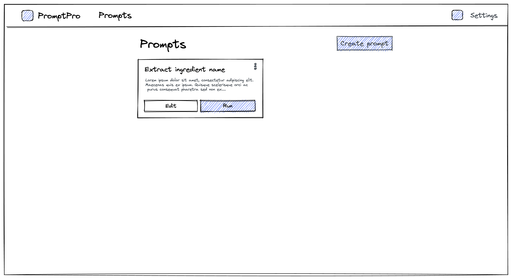
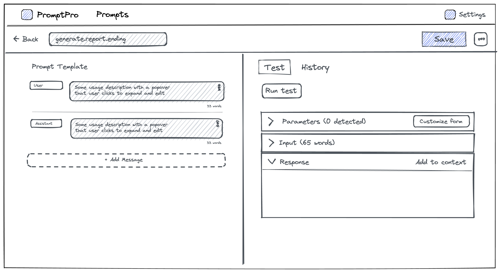

This blog post marks the first release of PromptPro into the wild. This release was the product of slightly more than a week of hacking on a key idea that I had when reading about all of the latest news about ChatGPT and all of the cool things that it can do.

## The Idea

I realised that there was such a massive potential for such a technology to make life easier for the average professional, opening up so much avenues for the average non-technical person. They could essentially tell ChatGPT to perform normally tedious tasks, instead of performing them manually. The incredibly low cost of the OpenAI's ChatGPT means that it is magnitudes cheaper to write a well-crafted prompt and repeatedly use it, than to outsource it to a person and have to train the individual(s).

I like to think of ChatGPT as the intern that tries really hard to be helpful but is overly confident in its factual knowledge. And we can basically throw time consuming and menial task over to our intern for pennies on the dollar, and even if it isn't a great output on the first try, we can keep refining our instructions until it is perfect every time.

## The Requirements

I knew that I wanted to build something off the ChatGPT API, and it was definitely interesting to explore the ways in which we could make the entire process even more user friendly, such that even my non-technically inclined mother could use it. I started to think up of certain use cases that my ideal future user (hi mom) would pass on to ChatGPT and let it do for her.

Some examples that would help her day job (she teaches young children privately 👩‍🏫):

1. Drafting up an email newsletter to her students' parents.
2. Reformatting of large online texts into small readable chunks for read-aloud tests.
3. Creating cloze passage vocabulary tests for her students.

With these example issues, I got around to the key requirements we need to make these a reality:

1. We want to make the prompt repeatable, but at the same time, accept varying input.
2. We want to be able to view what the prompt had returned before, so that we can refine the command in order to create a better sandbox for the returned information.
3. We want to have the prompt at the ready to quickly execute the prompt when needed.

### The Wireframes

Whenever it comes to testing out new UX patterns, I opt to use low-fideltiy wireframes to test out different flows, which helps me to iterate over different UI positioning. These are the wireframes that I used for the first iteration of the webapp, and if you were to navigate to the [actual deployed webapp](https://app.promptpro.tznc.net), you would notice that there are many areas that are different from the initial wireframes. I don't believe in being dogmatic and adhereing to a strict wireframe-before-development practice, as it tends to slow down the development price a lot. It is also quite tedious to keep the wireframe completely in sync with each new change in the UI. Hence, I only use the excalidraw wirefrmaes for visualising large UX flow changes.

## The Development Process

To build the MVP in the fastest manner possible, I opted to use a stack that I am very familiar with. Be warned that the following list includes personal opinoins on web development that suits my development style and perspective:

- Vite for application bundling, because I like how I don't have to think much about the tooling.
- Docusaurus for static site generation, because I like the out-of-the-box experience provided by the framework allows me to focus on content writing.
- Ant Design for the React component library, because I'm definitely not going to build everything from scratch. I also think that it is one of the most
- TailwindCSS for custom styling, because I like encapsulating all styling logic within my React components, instead of having to switch between different files for styling.

:::note
You can read about [how I combined Ant Design with TailwindCSS](https://www.tzeyiing.com/posts/combining-tailwindcss-with-ant-design-for-super-fast-and-simple-ui-development/), as well as [how I implemented dark mode in the app](https://www.tzeyiing.com/posts/taking-control-of-the-browser-dark-mode-with-ant-design-and-tailwindcss-for-dark-mode-wizardry/)
:::

Since I was deploying everything statically, I opted for Cloduflare Pages deployed via a Github Action, and

### Input Declaration Thought Process

As I am one of the main developers of [Logflare](https://github.com/Logflare/logflare) at my day job at [Supabase](https://supabase.com/), I was heavily inspired by the Logflare Endpoints feature that allows for parameter interpolation within SQL queries. Of course, in my version of [input templating](/docs/docs/features/input-templating), the way in which the end result is resolved is definitely much simpler, without needing to parse the SQL query as in Logflare. Of course, the `@` parameter style in Logflare is again borrowed through [BigQuery's named parameters](https://cloud.google.com/bigquery/docs/samples/bigquery-query-params-named), so this tyle of parameter declaration isn't new here.

Hence, I opted for the simple way of declaring inputs via the amersand (`@`) prefix, which maintains high readability in the text. I am not a fan of other templating syntax such as using brackets `{{}}` or angle brackets like `< >` or `<% %>`, which I think makes the template look busy and harder for non-technical persons to read.

Additionally, my use case does not the compiler-level features provided by web templating solutions like [Ejs](https://ejs.co/) or [Handlebars](https://handlebarsjs.com/). I have no plans at the moment to include if-else conditionals within the prompt templates, which would give rise to feature bloat (i.e. features that are not contributing to the actual requirements).

## The End Result

I'm actually quite happy with the final version that I cut for the initial release. I think that I do have a rather bad habit of trying to perfect every detail of a side project until I am happy with it, and I've started to realise that it doesn't really matter much.

In any case, do [give the webapp a spin](https://app.promptpro.tznc.net) and let me know what you think about it. You can always email me at <ty@tzeyiing.com>, open a bug report over at [GitHub issues](https://github.com/Ziinc/promptpro/issues) or request a feature over at [Github discussions](https://github.com/Ziinc/promptpro/discussions).

Development will continue for this project, as I have a lot of enhancements planned, so stay tuned!
