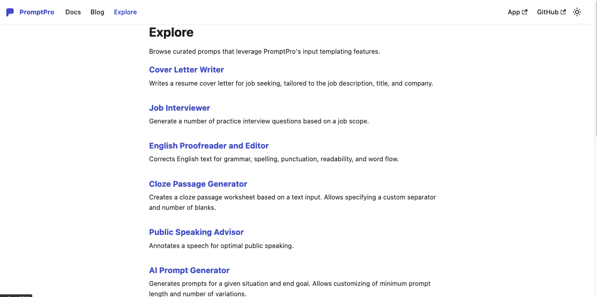
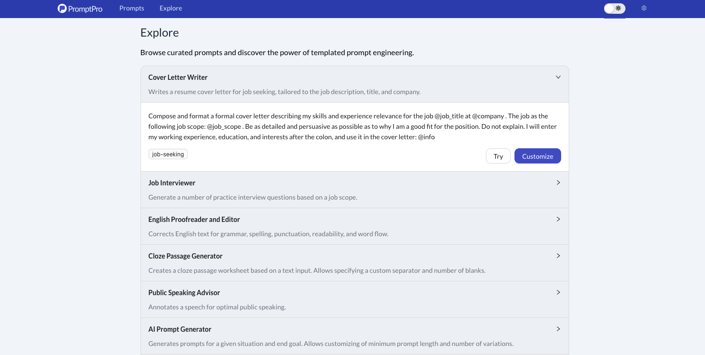

The **Explore** page for showcasing different templated prompts has been released. These example templated prompts are a great starting point for you to begin creating your very own PromptPro templates.

We have a public Explore page available at https://promptpro.tznc.net/explore, and you can browse the different prompts without entering the app.

Within the app itself, we have an in-app Explore page at https://app.promtppro.tznc.net/explore, and the difference is such that you can test out the prompts from within the app and try them out before extending and customizing the example prompts.

Of course, in order to try out the example prompts, you would need to enter your API key in the settings page.

We have example prompts for multiple different situations and professions. Hopefully, this new prompt gallery would give you inspiration to explore and test out different prompts that would help you out professionally and speed up your work processes.
