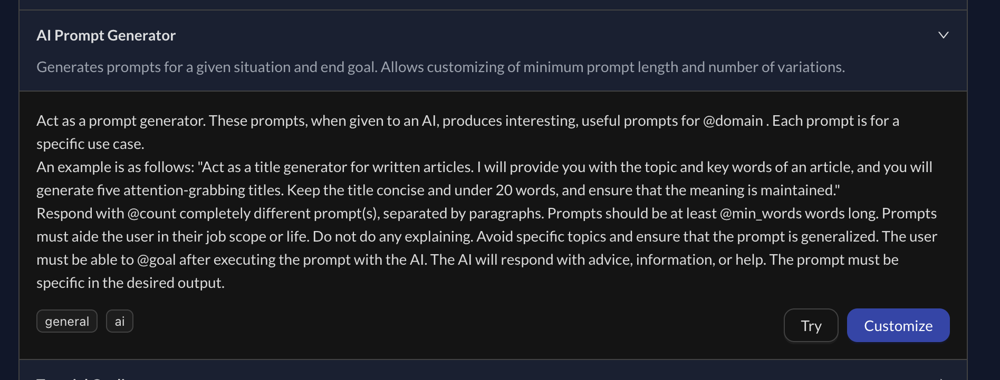

When developing the **Explore** page for the app, I needed to curate the prompt library and figured that I could automate part of it with the power of ✨PromptPro✨.

I hate having to do boring content generation, and trying to find permutations for new (or rather rehashed) ideas, and in my opinion LLMs work great for replacing all this wasted energy.

So when it came to building the initial prompt library, I came up with [this nifty prompt](https://promptpro.tznc.net/explore/ai-prompt-generator):



```
Act as a prompt generator. These prompts, when given to an AI, produces interesting, useful prompts for @domain . Each prompt is for a specific use case.

An example is as follows: "Act as a title generator for written articles. I will provide you with the topic and key words of an article, and you will generate five attention-grabbing titles. Keep the title concise and under 20 words, and ensure that the meaning is maintained."

Respond with @count completely different prompt(s), separated by paragraphs. Prompts should be at least @min_words words long. Prompts must aide the user in their job scope or life. Do not do any explaining. Avoid specific topics and ensure that the prompt is generalized. The user must be able to @goal after executing the prompt with the AI. The AI will respond with advice, information, or help. The prompt must be specific in the desired output.
```

To make the prompt a little more reliable, we turn it into a one-shot prompt by giving it an example. We also use a few inputs (like **@domain** and **@goal**) to make the prompt more customizable for different goals, and we can ask for variations as well using the **@count** parameter.

For some reason, ChatGPT-3.5 doesn't really adhere to the minimum word count all the time, and you might want to tweak or remove it. It does help with prompt length somewhat though.

In any case, this propmt helped me to create these few additional prompts:

- [Article Title Writer](https://promptpro.tznc.net/explore/article-title-writer/ "Explore - Article Title Writer | PromptPro")
- [Article Opener Writer](https://promptpro.tznc.net/explore/article-opener-writer/ "Explore - Article Opener Writer | PromptPro")
- [Article Conclusion Writer](https://promptpro.tznc.net/explore/article-conclusion-writer/ "Explore - Article Conclusion Writer | PromptPro")

There's many more domains that this prompt could work on, and the resultant prompt can always be tweaked with more inputs to make the results much more flexible.

Just another small reason why I'm so excited about PromptPro 🤩.
