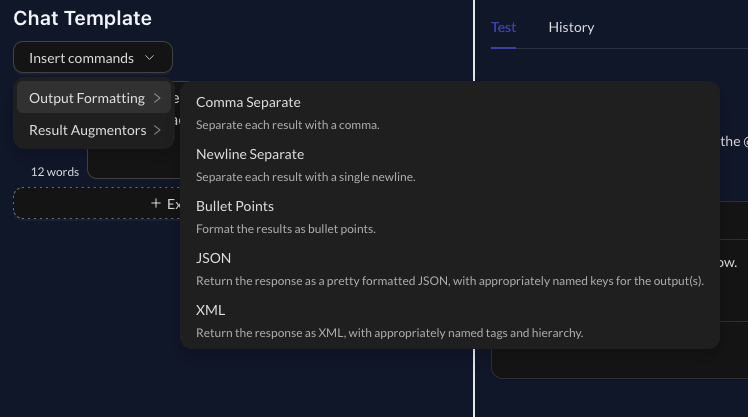
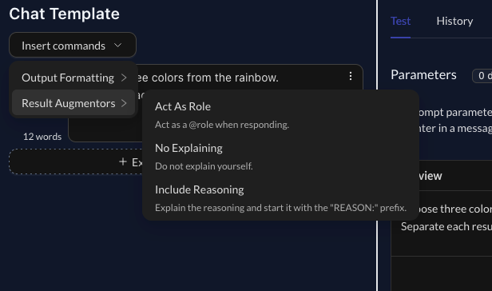
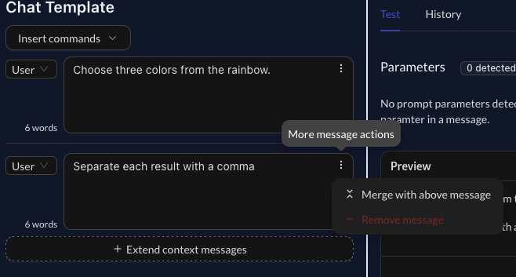

The Editor now has the ability to insert common template commands. This greatly simplifies the way in which one develops new prompts, removing repetitive writing.

I've included some common result formatting options, with two interesting ones such as JSON and XML. Of course, after adding them into your prompt you can customize them however you like.

The most commonly used ones will probably be bullet points, comma separation, and new line separation.

I've also added in **Result Augmentors**, which will alter the results based on the added command.

These are quite interesting when combined, and follow quite common patterns that I have found myself repeating.

When selected, the command will be appended to the last messsage in the chat template.

### Message Merging

As part of improving the editor experience, having too many user messages results in ChatGPT having a recency bias and "forgetting" about the older messages. As such, I've renamed the "Add New Message" button to "Extend context messages", and add in a message merging function to enable consolidating of messages.

This will help with improving the experience when adding new responses into the chat context.
