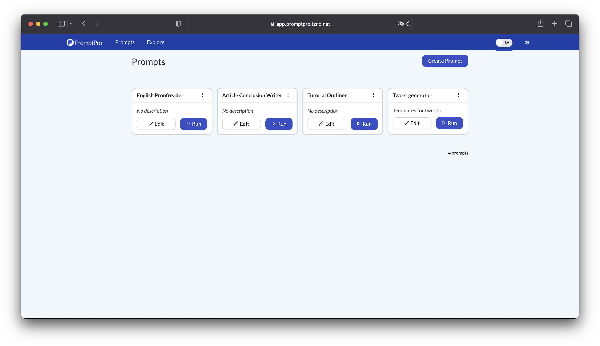
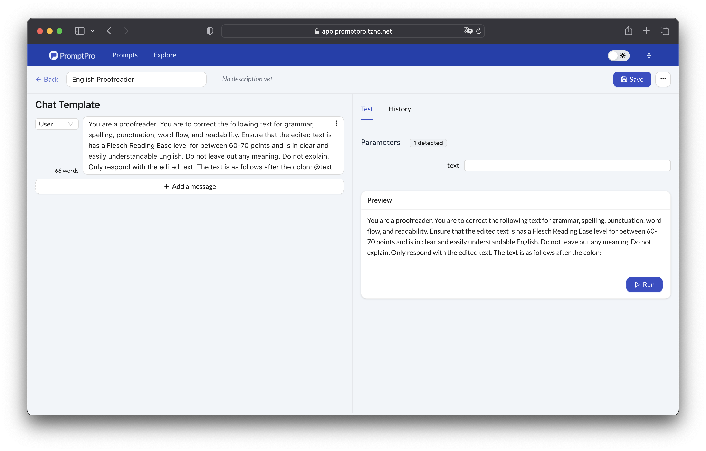
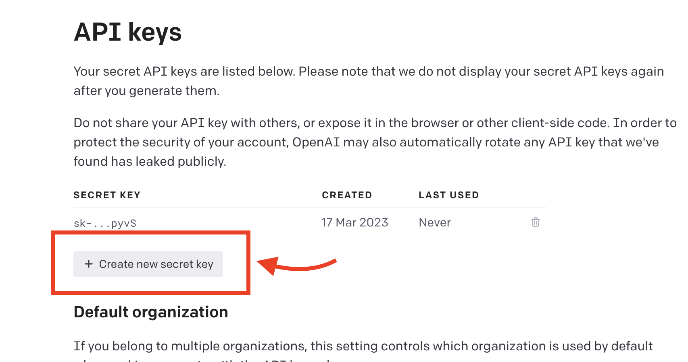
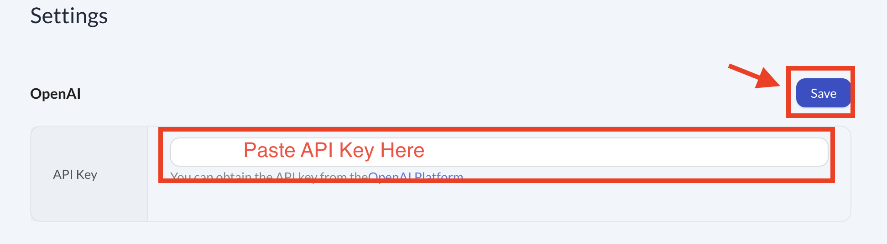
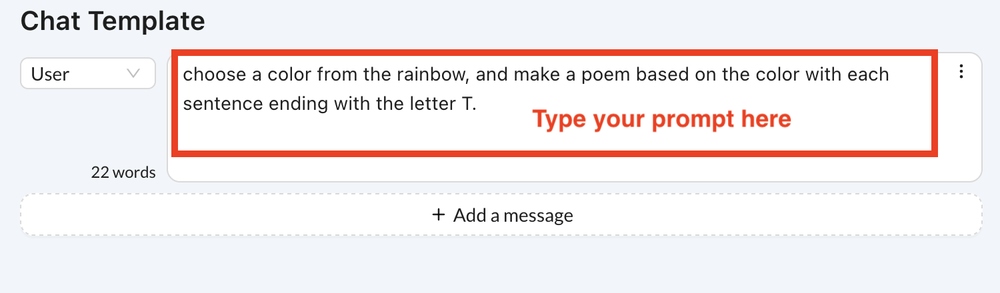
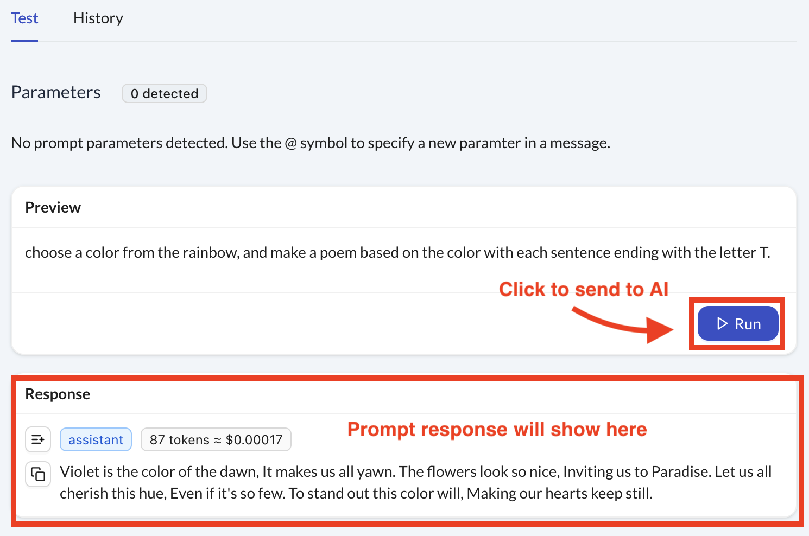

# Introduction

PromptPro is a prompt development environment, focusing on prompt engineering and automation. It is a free-to-use webapp.

The Editor interface helps iterative prompt development and testing, simplifying the process for refining prompts for a specific desired output.

## Getting Started

### !. Navigate to the app

Navigate to https://app.promptpro.tznc.net , which is the URL where the official webapp is hosted.

You will need to have an account with the [OpenAI Platform](https://platform.openai.com), which is the developer platform for interacting with OpenAI's APIs. You will need a credit card to sign up for the account.

### 2. Store your API key in the app

Generate a new API key under the [OpenAI Platform API Keys section](https://platform.openai.com/account/api-keys). Click on "Create new secret key".

Copy that API key and paste it into the API key setting under the [Settings](https://app.promptpro.tznc.net/settings).

:::info Security and Trust

PromptPro interacts directly with the OpenAI API from your browser, with no middleman service. All data is stored locally on the browser and can be reset at any time by the user. The API keys are not exposed beyond your local machine. Read more in the [security section](/docs/security-and-trust.md)
:::

### 3. Create and Run Your First Prompt

Navigate to the [Prompts section](https://app.promptpro.tznc.net) and click on "Create prompt".

Thereafter, start writing your first prompt:

Execute the prompt by clicking on "Run", and you've got your first AI response!

## Next Steps

To level up your prompt engineering skills, explore these key features that will unlock the development power of PromptPro:

- [Input Templating](/docs/features/input-templating)
<!-- - [Iterations and Run History](/docs/iterations-and-run-history) -->
